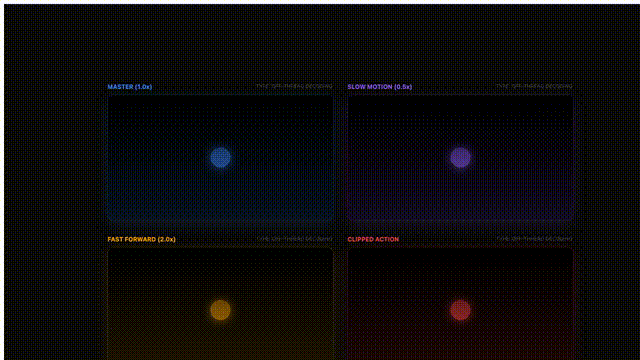

# OpenMotion

<p align="center">
  
</p>

<p align="center">
  <strong>The open-source programmatic video engine for React developers.</strong>
</p>

<p align="center">
  <a href="#-features">Features</a> •
  <a href="#-packages">Packages</a> •
  <a href="#-installation">Installation</a> •
  <a href="#-quick-start">Quick Start</a> •
  <a href="#-cli-reference">CLI Reference</a> •
  <a href="#-api-reference">API Reference</a>
</p>

---

OpenMotion is a high-performance, open-source alternative to Remotion. It allows you to create frame-perfect videos using familiar React components, hooks, and your favorite CSS libraries.

### 🎬 Showcases

| Feature Showcase | Media Showcase |
| :---: | :---: |
|  |  |
| Brand, Dashboard, Easing | Video, Audio |

## ✨ Features

- ⚛️ **React-First**: Use the full power of the React ecosystem.
- 🤖 **AI-Powered Generation**: Create entire videos from text descriptions using LLMs.
- ✍️ **AI-Assisted Editing**: Edit your TSX scenes using natural language.
- ⏱️ **Frame-Perfect Determinism**: Advanced time-hijacking ensures every frame is identical.
- 🚀 **Parallel Rendering**: Scale your rendering speed by utilizing all CPU cores.
- 🎵 **Multi-track Audio Mixing**: Support for multiple `<Audio />` with independent volume.
- 📈 **Animation Components**: Built-in library for Loop, Transitions, Easing, and more.
- 📦 **External Integrations**: Native support for **Three.js** and **Lottie** animations.
- 💬 **Caption System**: Automated subtitle rendering with SRT support and TikTok-style animations.
- 📊 **Media Analysis**: Dynamic metadata extraction for video/audio (duration, dimensions).
- 📹 **Offthread Video**: High-performance video decoding moved to background processes.
- 📊 **Dynamic Metadata**: Calculate video dimensions, duration, and other properties dynamically.
- 🎬 **GIF & Video Output**: Render to MP4, WebM, GIF, and WebP formats.

## 📦 Packages

| Package | Description |
| :--- | :--- |
| [`@open-motion/core`](./packages/core) | React primitives (`Composition`, `Sequence`, `Loop`), hooks, and media utils. |
| [`@open-motion/components`](./packages/components) | High-level components (`Transition`, `ThreeCanvas`, `Lottie`, `Captions`). |
| [`@open-motion/renderer`](./packages/renderer) | Playwright-based capture engine. |
| [`@open-motion/cli`](./packages/cli) | Command-line interface. |

## 🛠 Installation

```bash
npm install @open-motion/core @open-motion/components
```

## 🔧 Building from Source

To build from source, you'll need [Node.js](https://nodejs.org/) and [pnpm](https://pnpm.io/).

```bash
git clone https://github.com/jsongo/open-motion.git
cd open-motion
pnpm install
pnpm build
```

### Windows: Setting up pnpm global link

If you want to use `pnpm link --global` on Windows, you may need to set up the global bin directory first:

```powershell
$env:PNPM_HOME = "C:\Users\<YourUser>\AppData\Local\pnpm"
$env:PATH += ";$env:PNPM_HOME"
cd packages/cli
pnpm link --global
```

Alternatively, run `pnpm setup` and restart your terminal to apply the environment variables automatically.

## 🚀 Quick Start

### 1. Setup
Install CLI tools and required browsers:
```bash
pnpm install -g @open-motion/cli @open-motion/renderer
npx playwright install chromium
```

If Japanese/Chinese/Korean text renders as squares in headless Linux, it's usually missing system fonts. Either install CJK fonts (recommended) or load a local font at render time.

- Install system fonts (Ubuntu/Debian): `sudo apt-get update && sudo apt-get install -y fonts-noto-cjk`
- Or load a local font file: `open-motion render ... --font "Noto Sans JP=./public/fonts/NotoSansJP-Regular.woff2"`

### 2. Create Project
```bash
mkdir -p my_videos && cd my_videos
open-motion init my-video1
cd ../..  # Return to monorepo root
pnpm install
```

### 3. Develop & Render

Start the dev server in one terminal:

```bash
cd my_videos/my-video1
pnpm run dev
```

or

```bash
pnpm --filter my-video1 dev
```

In another terminal, render your video using the server URL:
```bash
open-motion render -u http://localhost:5173 -o out.mp4 --composition my-video1
```

## 💻 CLI Reference

### `open-motion init <name>`
Initialize a new OpenMotion project with a pre-configured React template.

### `open-motion generate <description>`
Automatically generate video scenes and code from a text description using an LLM.

| Option | Description |
| :--- | :--- |
| `--provider <name>` | LLM provider (`openai`, `anthropic`, `google`, `openrouter`, `ollama`, `openai-compatible`) |
| `--model <name>` | Model name (e.g., `gpt-5.2`, `claude-4-6-sonnet`) |
| `--scenes <number>` | Number of scenes to generate |
| `--fps <number>` | Frames per second (default: 30) |
| `--width <number>` | Video width (default: 1280) |
| `--height <number>` | Video height (default: 720) |

### `open-motion edit <file>`
Edit a TSX scene file using natural language instructions.

| Option | Description |
| :--- | :--- |
| `-m, --message <msg>` | Instruction for editing |
| `-y, --yes` | Auto-apply changes (one-shot mode) |

### `open-motion config`
Manage LLM provider settings (API keys, models).

- `open-motion config list`
- `open-motion config get <VAR>`

LLM settings are read from environment variables (you can put them in a project-local `.env` file):

```bash
# .env
OPEN_MOTION_PROVIDER=openai
OPENAI_API_KEY=sk-...
```

### `open-motion render`
Render a video from a running OpenMotion application.

| Option | Description |
| :--- | :--- |
| `-u, --url <url>` | **Required.** URL of the OpenMotion app (e.g., `http://localhost:5173`) |
| `-o, --out <path>` | **Required.** Output file path (e.g., `out.mp4`, `animation.gif`) |
| `-c, --composition <id>` | ID of the composition to render |
| `-p, --props <json>` | JSON string of props to pass to the composition |
| `-j, --concurrency <n>` | Number of parallel browser instances (default: 1) |
| `--format <format>` | Output format: `mp4`, `webm`, `gif`, `webp`, `auto` |
| `--width <number>` | Override output width |
| `--height <number>` | Override output height |
| `--fps <number>` | Override frames per second |
| `--duration <number>` | Override total frames to render |
| `--public-dir <path>` | Public directory for static assets (default: `./public`) |
| `--chromium-path <path>`| Path to custom Chromium executable |
| `--timeout <number>` | Timeout for browser operations in ms |
| `--font <spec>` | Load a local font file for rendering (repeatable). Format: `Family=path` or just `path` |
| `--bgm <path>` | Add a background music track from a local MP3 file |
| `--bgm-volume <number>` | BGM volume (0.0-1.0, default: 1.0) |

Example (render-time BGM):

```bash
open-motion render -u http://localhost:5173 -o out.mp4 --bgm ./music/bgm.mp3 --bgm-volume 0.5
```

Notes:
- If the BGM is shorter than the video, it will loop to cover the full duration.
- If the BGM is longer than the video, it will be trimmed to the video duration.

## 📚 API Reference

### Core Hooks & Configuration
**`useCurrentFrame()`**: Get the current frame number.
**`useVideoConfig()`**: Access width, height, fps, and duration.

### Components
- **`<Loop />`**: Create looping time contexts.
- **`<Transition />`**: Smooth enter/exit effects (`fade`, `wipe`, `slide`, `zoom`).
- **`<ThreeCanvas />`**: Render synced Three.js scenes.
- **`<Lottie />`**: Declarative Lottie animations.
- **`<Audio />`**: Multi-track audio with volume control.
- **`<Captions />`** / **`<TikTokCaption />`**: Subtitle rendering.
- **`<OffthreadVideo />`**: High-performance background video decoding.

### Utilities
- **`interpolate()`**: Map ranges with easing support.
- **`Easing`**: Complete library of easing functions.
- **`parseSrt()`**: Convert SRT files to data structures.
- **`getVideoMetadata()`**: Fetch dimensions and duration of video files.

## 💡 Best Practices

### Robust Rendering
For production, use the project's built-in `npm run render` script. It handles the full **build -> static server -> render -> cleanup** pipeline, eliminating buffer issues.

### Asset Storage
Place all local assets in `public/` and reference them via absolute paths (e.g., `/video.mp4`).

## 📜 License

MIT © [jsongo](https://github.com/jsongo)
